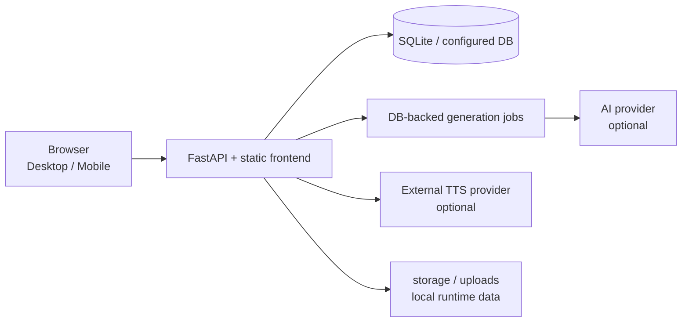

# StoryLingo 語閱

StoryLingo 是一個以長篇小說為核心的開源參考平台，讓讀者可以探索作品、閱讀、聽書與進行語言學習，也讓作者能建立作品、管理章節與追蹤內容狀態。

這個 repository 的定位是**可審查、可學習、可自行延伸的 reference implementation**。它不是一鍵即可承擔正式流量的 SaaS 套件；正式部署仍需要自行完成密鑰管理、郵件／OAuth、資料庫備份、外部 TTS 服務、網域與監控設定。產品與工程稽核紀錄請從 [`PRODUCT_ENGINEERING_AUDIT.md`](PRODUCT_ENGINEERING_AUDIT.md) 開始閱讀。

## 先看畫面

以下截圖使用合成內容，不包含真實帳號、作品或服務金鑰：

| 首頁 | 作品詳情與閱讀入口 |
| --- | --- |
| [Desktop](docs/screenshots/home-desktop.png) · [Mobile](docs/screenshots/home-mobile.png) | [Desktop](docs/screenshots/book-detail-desktop.png) · [Mobile](docs/screenshots/book-detail-mobile.png) |

| Reader | 作者工作台 |
| --- | --- |
| [Mobile reader](docs/screenshots/reader-mobile.png) | [Desktop workbench](docs/screenshots/author-workbench-desktop.png) |

更多截圖說明與重新產生方式見 [`docs/screenshots/README.md`](docs/screenshots/README.md)。

## 目前包含的能力

- 公開首頁、分類／搜尋、排行榜、作品詳情與目錄。
- 閱讀器的章節導覽、閱讀進度、沉浸式閱讀模式與音訊入口。
- 書架／收藏、登入後個人頁與個人設定。
- 作者工作台、作品建立與設定、章節管理、草稿與版本歷史。
- AI 分析與外部 TTS provider 的明確邊界；平台不把模型或 CUDA runtime 直接塞進 Web 服務。
- CSRF、權限、章節可見性、非同步請求競態、草稿恢復與多分頁衝突保護。
- 後端單元／整合測試、前端單元測試與 Desktop／Mobile Playwright 流程測試。

## 架構一覽



資料模型與目前已完成的安全不變量以 [`ARCHITECTURE.md`](ARCHITECTURE.md) 為準；模組位置見 [`PROJECT_MAP.md`](PROJECT_MAP.md)。

## 本機開發

需求：Python 3.10+、Node.js 20+、npm。Windows PowerShell 範例：

```powershell
python -m venv .venv
.\.venv\Scripts\Activate.ps1
python -m pip install -r requirements.txt
npm ci
Copy-Item .env.example .env
python run.py
```

開啟 <http://127.0.0.1:8000/>。首次啟動請在 `.env` 設定一組只供本機使用的 `ADMIN_PASSWORD`；AI 與 TTS 是可選 provider，沒有設定時仍可使用不依賴它們的瀏覽與閱讀流程。

不要把 `.env`、`data/`、`storage/`、`uploads/`、`logs/` 或任何測試資料複製到公開 repository。`.env.example` 只放欄位名稱與佔位值，真正的值應由本機 secret manager 或部署平台注入。

## 測試與品質門檻

```powershell
python -m pytest backend/tests -q
npm run test:unit
npm run test:e2e
node --check frontend/app.js
node --check frontend/platform.js
python -m compileall backend
```

E2E 會同時驗證 Chromium Desktop 與 Pixel 5 Mobile。CI 設定見 [`.github/workflows/ci.yml`](.github/workflows/ci.yml)。若只修改文件，可以跳過瀏覽器測試，但產品流程或 API 行為變更應保留完整回歸證據。

## 部署與外部服務

Server 產包與 Docker／反向代理範例在 [`deploy/server/README.md`](deploy/server/README.md) 與 [`scripts/package_deployment.ps1`](scripts/package_deployment.ps1)。部署包刻意不包含本機模型、CUDA、資料庫內容與上傳檔案；外部 TTS 服務也必須獨立設定。正式環境至少要完成：

1. secret manager、長隨機密碼、HTTPS、CORS／`PUBLIC_ORIGINS`。
2. 資料庫與上傳檔案的備份、還原演練與磁碟容量監控。
3. OAuth／寄信 provider 的正式設定與失敗告警。
4. AI／TTS provider 的配額、逾時、重試與成本控管。
5. 版本化 migration、health check、log redaction 與回滾流程。

這些項目未完成前，請把環境標示為 development、staging 或 demo，不要宣稱 production ready。

## 安全與隱私

請先閱讀 [`SECURITY.md`](SECURITY.md)。發現疑似金鑰外洩時，不要把值貼到 Issue、PR、截圖或聊天紀錄；先撤銷／輪替，再以私密方式回報。前端不得讀取 AI／TTS secret，外部 provider 呼叫應經後端邊界。

## 參與開發

請依 [`AGENTS.md`](AGENTS.md) → [`PROJECT_MAP.md`](PROJECT_MAP.md) → [`ARCHITECTURE.md`](ARCHITECTURE.md) 的順序了解規範與現況，再閱讀相關 source 與測試。提交前請看 [`CONTRIBUTING.md`](CONTRIBUTING.md)，不要把與任務無關的本機檔案或歷史稽核資料一起加入公開版本。

## 授權

本公開快照採用 [Apache-2.0](LICENSE)。你可以重用、修改與散布本專案，但請保留授權與著作權聲明，並依授權條款處理修改檔案與專利授權。第三方套件、模型與外部服務仍受各自授權或服務條款約束。
